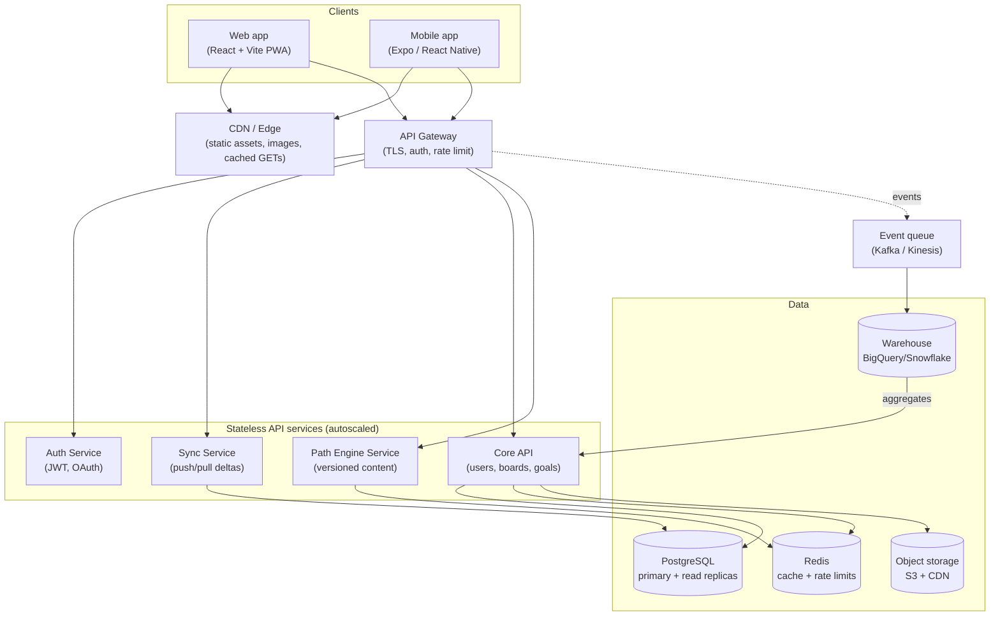
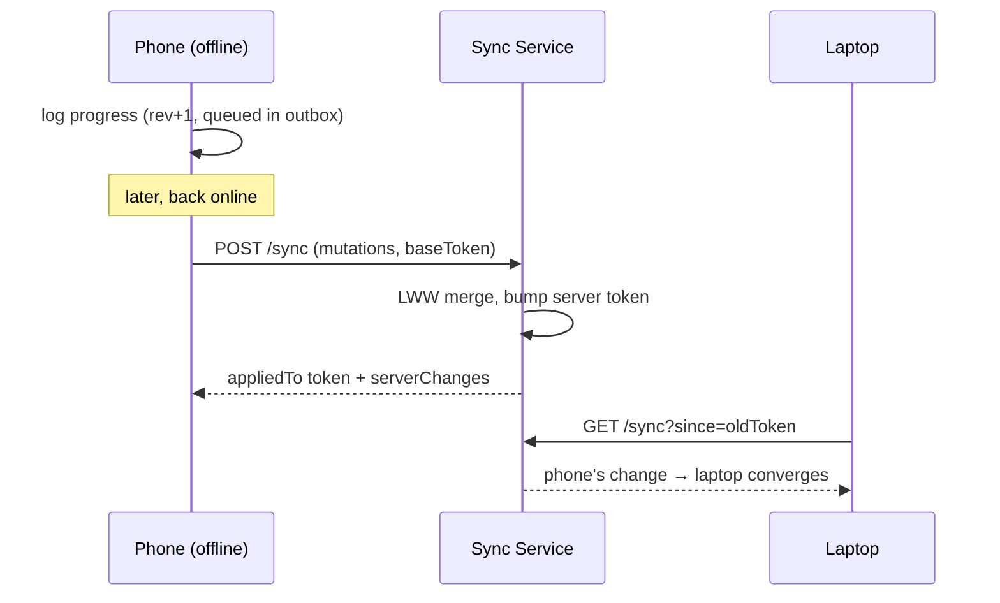

# Nova — System Design

> How Nova would be built as a **real, multi-platform product at scale** — not the
> local-first demo, but the version with millions of users, a web app, a mobile app,
> a backend, sync, and analytics.
>
> This doc is written to be read like a **system-design interview answer**: it starts
> from requirements, sizes the problem, proposes an architecture, then goes deep on the
> two genuinely hard parts (offline sync and the analytics/North-Star pipeline) and the
> trade-offs behind each decision. Sections marked **🗣️ Explain** narrate the reasoning
> out loud.

---

## 1. Problem statement

Nova today is **local-first**: both the web app and the mobile app store everything on the
device (`localStorage` / `AsyncStorage`) with no backend. That's the right call for an MVP
(zero friction, instant, free to run). This document designs the **next stage**: the same
product with accounts, multi-device sync, a served path-engine, and analytics — while
**keeping the local-first, offline-first feel** users already have.

**🗣️ Explain:** The design goal isn't "add a backend." It's "add a backend *without losing*
the instant, works-on-the-subway experience." That constraint drives most of the interesting
decisions below (offline-first sync, optimistic writes).

---

## 2. Requirements

### Functional
- Users capture **pins** (ideas) on **boards**, set measurable **goals**, and log progress.
- Users pick a **creator archetype** and receive a **path** (roadmap, levers, next steps).
- Data is available on **all of a user's devices** (phone + web), and **offline**.
- A **North Star metric** (avg goal progress) and supporting analytics are computed per user.
- Content (the path engine) can be **updated by the Nova team without an app release**.

### Non-functional (the numbers that shape the design)
| Attribute | Target |
|---|---|
| Read latency (dashboard) | p95 < 200 ms (server); **0 ms perceived** (local-first) |
| Write | Optimistic/instant locally; synced < 2 s when online |
| Offline | Full read **and** write with no connectivity; sync on reconnect |
| Availability | 99.9% for the API (43 min/month budget) |
| Durability | No lost user data; conflicts resolved deterministically |
| Privacy | Audience skews **under-18** → strict data minimization (see §12) |

---

## 3. Scale assumptions (back-of-the-envelope)

Being honest about scale is part of the job — Nova is a **mid-scale consumer app**, not
Twitter. Sizing keeps us from over-engineering.

```
Registered users .......... 5,000,000
DAU ....................... 500,000        (~10% of MAU)
Writes  (progress, pins) .. 500k DAU × 10/day  = 5M/day  ≈ 58/s avg, ~300/s peak
Reads   (dashboard, path) . 500k DAU × 15/day  = 7.5M/day ≈ 90/s avg, ~500/s peak
Structured storage ........ 5M × ~25 KB (profile+goals+pins meta) ≈ 125 GB
Image uploads (optional) .. 5M × 20 imgs × 200 KB ≈ 20 TB  → object storage + CDN
```

**🗣️ Explain:** ~300 writes/s and ~500 reads/s is small — a single well-indexed Postgres
primary with read replicas handles this comfortably. So the architecture optimizes for
**offline sync correctness, developer velocity, and cost**, not raw throughput. Claiming you
need Cassandra/sharding here would be a red flag, not a strength.

---

## 4. High-level architecture



**Component responsibilities**
- **Clients** keep a full **local database** (the source of truth for the UI) and talk to the
  backend only to sync. This is what preserves the offline-first feel.
- **CDN/Edge** serves the static app bundles, user images, and cacheable GETs (like the path
  content) close to the user.
- **API Gateway** terminates TLS, authenticates the JWT, and rate-limits.
- **Core API / Sync / Path / Auth** are **stateless** services → scale horizontally behind a
  load balancer; any instance can serve any request.
- **Postgres** is the system of record. **Redis** caches hot reads and holds rate-limit
  counters. **Object storage + CDN** holds images. **Warehouse** powers analytics.

**🗣️ Explain:** Stateless services + one relational DB + a cache is the boring, correct core
for this scale. The two things that make Nova *not* boring — **sync** and the **path engine** —
get their own sections.

---

## 5. Clients: offline-first by design

Both clients follow the same model (already true in the MVP, minus the network):

1. **Local store is the UI's source of truth.** Reads never wait on the network → 0 ms
   perceived latency. (Web: IndexedDB in prod; Mobile: SQLite/AsyncStorage.)
2. **Writes are optimistic.** A change updates local state immediately and is appended to an
   **outbox** (a durable queue of pending mutations).
3. **A background sync** drains the outbox to the server and pulls remote changes.

**🗣️ Explain:** This is why the app feels instant and works on a plane. The trade-off is
complexity: we now have *two* copies of the data and must reconcile them — that's §7.

---

## 6. API design

REST over HTTPS, JSON. Versioned (`/v1`). Auth via `Authorization: Bearer <JWT>`.

| Method & path | Purpose |
|---|---|
| `POST /v1/auth/anonymous` | Create an anonymous identity for a fresh device |
| `POST /v1/auth/upgrade` | Attach email/OAuth to the anonymous user (merges data) |
| `POST /v1/auth/refresh` | Exchange refresh token for a new access token |
| `GET  /v1/sync?since=<token>` | Pull all changes since a sync token (deltas) |
| `POST /v1/sync` | Push a batch of local mutations (the outbox) |
| `GET  /v1/paths?version=<v>` | Fetch path-engine content (heavily CDN-cached) |
| `POST /v1/uploads` | Get a pre-signed URL to upload a pin image to object storage |
| `GET  /v1/me/insights` | Server-computed analytics (trends the client can't cheaply derive) |

**Example — push mutations (the outbox):**
```jsonc
POST /v1/sync
{
  "clientId": "device-abc",
  "baseToken": "1699999999-42",
  "mutations": [
    { "op": "upsert", "entity": "goal", "id": "g_9x",
      "fields": { "current": 6, "target": 12 }, "updatedAt": "2026-08-13T10:00:00Z", "rev": 4 },
    { "op": "delete", "entity": "pin", "id": "p_2a", "updatedAt": "2026-08-13T10:01:00Z" }
  ]
}
// → 200 { "appliedTo": "1700000000-73", "conflicts": [], "serverChanges": [ ... ] }
```

**🗣️ Explain:** Sync is **batch, not per-write** — the client flushes its outbox in one request.
That cuts request volume ~10× and makes offline (queue up 50 changes, sync once) natural.

---

## 7. Offline-first sync — the hard part

Each syncable row carries sync metadata:

```
id, userId, entityType, payload(jsonb),
updatedAt (server-authoritative), rev (int), deleted (bool, tombstone)
```

**Protocol (delta sync):**
1. Client pulls with its last **sync token** → server returns every row changed since then.
2. Client applies remote changes, then pushes its outbox.
3. Server assigns a new token (a monotonic `(timestamp, seq)`), returns it + any conflicts.

**Conflict resolution: Last-Write-Wins (LWW) per entity, server clock authoritative.**
- Nova is **single-user, multi-device** — real conflicts are rare (you're not co-editing with
  a stranger; you just used your phone then your laptop).
- LWW by `updatedAt` is simple and deterministic. Deletes use **tombstones** so a delete on
  one device isn't resurrected by a stale edit on another.



**🗣️ Explain — why not CRDTs?** CRDTs shine for *concurrent multi-author* editing (Google
Docs). Nova is one author on a few devices, so CRDTs' overhead and complexity aren't worth it —
LWW + tombstones is the right-sized answer. Naming *why you didn't* use the fancy option is
exactly what senior reviewers look for.

---

## 8. The Path Engine as a service

Today the archetype→roadmap logic is a hard-coded file (`paths.js`). At scale it becomes a
**content-as-data service** so the team can improve advice without shipping an app update.

- Path content lives in a versioned store (`path_content` table / JSON docs), keyed by
  `archetype` + `contentVersion`.
- `GET /v1/paths?version=v` is **immutable + CDN-cached** (long TTL). New content = new version.
- Clients cache the content locally so **My Path works offline**; they upgrade version on next sync.
- Still **rules-based, not AI** (see the product doc's decision log) — deterministic, reviewable,
  cheap, offline-capable. This service is where future A/B tests on advice would run.

**🗣️ Explain:** Turning content into versioned data is the difference between "an engineer edits
code to change a tip" and "the growth team ships a better roadmap on Tuesday." It also makes the
advice **experimentable** — you can measure which roadmap variant drives more first breaks.

---

## 9. Data model

```mermaid
erDiagram
  USER ||--o{ BOARD : owns
  USER ||--o{ GOAL : owns
  USER ||--o{ PIN : owns
  USER ||--|| PROFILE : has
  BOARD ||--o{ PIN : contains
  BOARD ||--o{ GOAL : contains
  GOAL ||--o{ MILESTONE : has
  PROFILE }o--|| ARCHETYPE : "chose"

  USER { uuid id PK; text auth_kind; timestamptz created_at }
  PROFILE { uuid user_id FK; text archetype; timestamptz updated_at }
  BOARD { uuid id PK; uuid user_id FK; text name; text emoji; int rev; bool deleted }
  PIN { uuid id PK; uuid board_id FK; text title; text note; text image_url; jsonb tags; int rev; bool deleted }
  GOAL { uuid id PK; uuid board_id FK; text title; text metric_label; numeric current; numeric target; date due_date; int rev; bool deleted }
  MILESTONE { uuid id PK; uuid goal_id FK; text title; bool done }
  ARCHETYPE { text id PK; text name; jsonb content; int content_version }
```

- Every user-owned row has `rev`, `deleted`, `updated_at` for sync (§7).
- Index on `(user_id, updated_at)` powers delta pulls efficiently.
- `payload jsonb` variant keeps the sync service **entity-agnostic** (one code path syncs all types).

---

## 10. Caching & CDN
- **Static app + images** → CDN edge, immutable hashed filenames (already how Vite builds).
- **Path content** → CDN-cached by version; near-zero origin load.
- **Redis** caches server-computed insights and holds rate-limit counters; cache-aside with
  short TTLs, invalidated on write.

## 11. Analytics & the North Star pipeline
Client-side we already show the **North Star** (avg goal progress). At scale we also need
**product analytics** (activation, retention, the core-bet hypothesis from the product doc).

```
Client events ──▶ API Gateway ──▶ Event queue (Kafka) ──▶ Warehouse (BigQuery)
                                                     └──▶ dashboards (activation, W2 retention)
```
- Emit events: `archetype_selected`, `goal_tracked`, `progress_logged`, `session_start`.
- The warehouse answers the product bet: *do path-choosers retain better than pin-only users?*
- Aggregates (e.g., percentile benchmarks) flow back to `GET /me/insights`.

**🗣️ Explain:** The in-app North Star is for the *user*; this pipeline is for the *team*. Keeping
them separate avoids bloating the write path with analytics and lets analysts iterate freely.

---

## 12. Auth, security & privacy
- **Anonymous-first:** a fresh device gets an anonymous user id, so the app works before signup
  (preserves zero-friction onboarding). Later `upgrade` attaches email/OAuth and **merges** the
  anonymous data into the account.
- **JWT** access tokens (short-lived) + refresh tokens (rotated, revocable).
- **Minors:** the audience skews under-18, so this is a first-class concern, not a footnote —
  data minimization, no behavioral ad tracking, parental-consent flows where required
  (COPPA/GDPR-K), and region-aware handling. TLS in transit, encryption at rest, per-user data
  export & delete.

**🗣️ Explain:** Calling out the under-18 audience unprompted signals product maturity — the
right architecture for a Gen-Z app bakes privacy in rather than bolting it on.

## 13. Reliability & observability
- **SLOs:** 99.9% API availability, p95 sync < 2 s. Error budget gates risky releases.
- **Observability:** structured logs, RED metrics (Rate/Errors/Duration) per service, distributed
  tracing on the sync path, alerting on sync-failure rate and outbox age.
- **Failure modes:** client keeps working offline if the API is down (outbox just grows); DB
  read-replica failover; queue buffers analytics during warehouse outages.

## 14. Cost & scaling posture
- At the assumed scale: a modest managed Postgres (primary + 2 replicas), a small Redis, autoscaled
  stateless services, object storage + CDN. **Scale up before scaling out.**
- Next bottleneck would be **write throughput or storage**, addressed by read replicas → table
  partitioning by `user_id` → (only if truly needed) sharding. Documented, not pre-built.

---

## 15. Key trade-offs (the decision log)

| Decision | Chose | Over | Why |
|---|---|---|---|
| Data topology | Offline-first, local source of truth | Server-authoritative | Keeps the instant, works-offline feel that defines the product |
| Conflict resolution | LWW + tombstones | CRDTs | Single-user/multi-device → concurrent-author complexity isn't warranted |
| Sync shape | Batch delta sync (outbox) | Per-write API calls | ~10× fewer requests; natural offline behavior |
| Datastore | One Postgres (+replicas) | NoSQL / sharding | Mid-scale reads/writes; relational integrity + simplicity win |
| Path engine | Versioned content service, rules-based | AI generation | Consistent, reviewable, cacheable, offline; experimentable |
| Analytics | Async event pipeline | Synchronous writes to app DB | Keeps the write path lean; lets analysts iterate |

## 16. If I had to extend it next
1. Real-time nudges/streaks via push notifications (retention lever from the product roadmap).
2. A/B testing framework on path content (which roadmap drives more first breaks?).
3. Optional social layer (share a board) — gated behind proven retention, adds real multi-author
   sync complexity (this is where CRDTs might finally earn their keep).

---

## 🗣️ 17. How I'd present this in an interview (the 2-minute version)

> "Nova is offline-first, so the design goal is adding a backend *without* losing the instant,
> works-offline feel. Each client keeps a local DB as the UI's source of truth and an outbox of
> pending writes; a batch **delta-sync** service reconciles with Postgres. Because it's
> single-user/multi-device, I resolve conflicts with **last-write-wins + tombstones** rather than
> CRDTs — right-sized for the problem. The scale is modest (~hundreds of writes/sec), so it's one
> Postgres with read replicas, Redis, and a CDN — I'd *scale up before out*. The two interesting
> pieces are the **sync protocol** and turning the **path engine into versioned, cacheable content**
> so growth can improve advice without an app release and A/B test it. Analytics run async through a
> queue into a warehouse to answer the core product bet — do path-choosers retain better? — without
> bloating the write path. And because the audience skews under-18, privacy and data minimization
> are designed in from the start."
